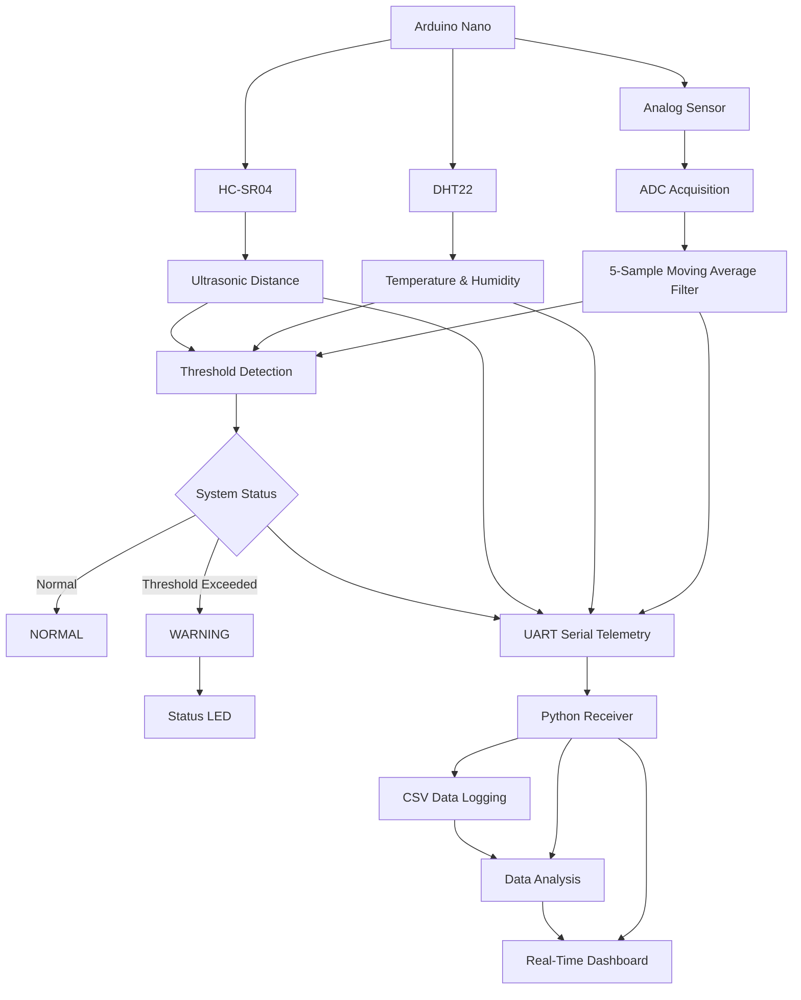
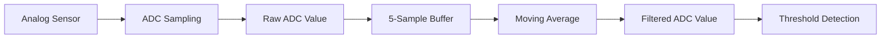
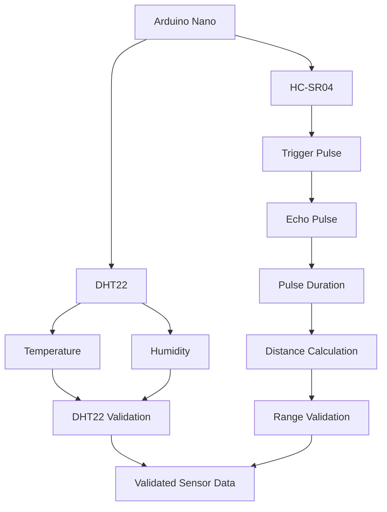
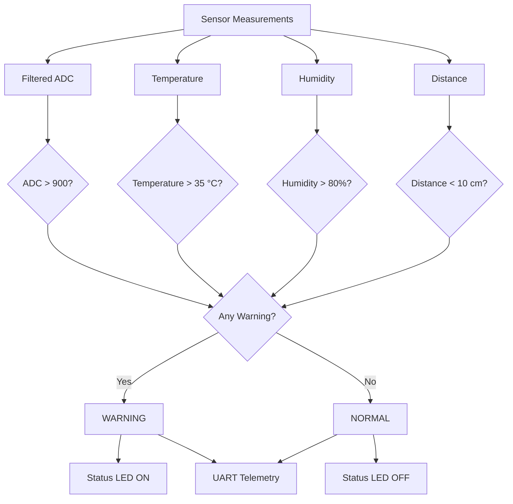
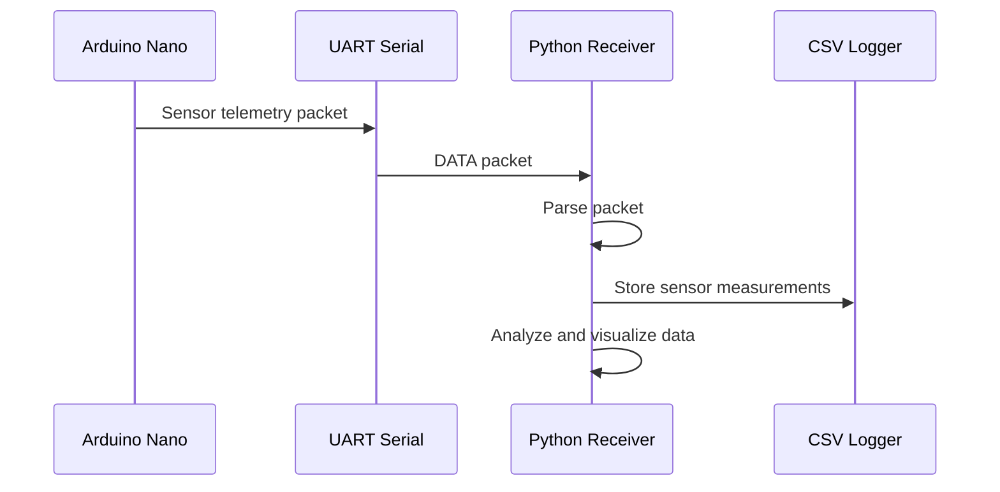
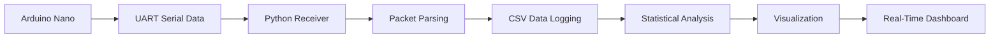
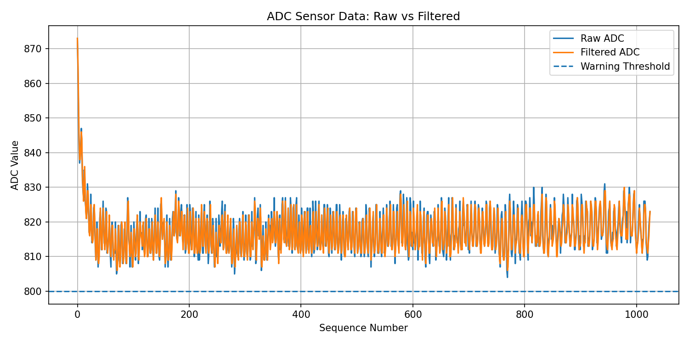
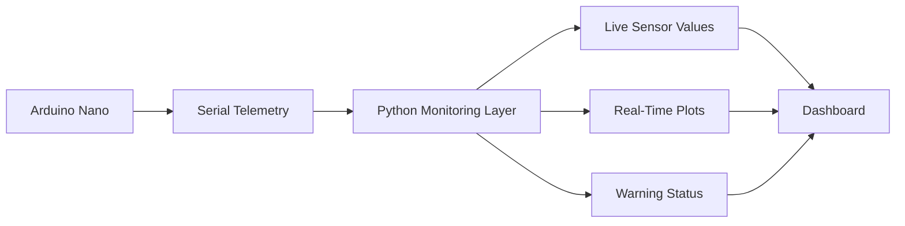

# Real-Time Multi-Sensor Monitoring System

## Project Overview

A real-time embedded sensing and monitoring system developed using an Arduino Nano, DHT22 temperature and humidity sensor, HC-SR04 ultrasonic sensor, and an analog sensor input.

The system performs real-time sensor acquisition, ADC signal processing, 5-sample moving-average filtering, threshold-based warning detection, and UART telemetry. Sensor measurements are transmitted to a Python-based monitoring system for data logging, analysis, and visualization.

The project demonstrates embedded sensor interfacing, analog signal acquisition, digital signal filtering, real-time data processing, and hardware-software integration.

## System Architecture

The system is divided into two main layers:

1. **Embedded Layer** — responsible for sensor acquisition, ADC processing, filtering, threshold detection, and UART transmission.
2. **Monitoring Layer** — responsible for receiving, logging, analyzing, and visualizing the sensor data.



## Hardware Components

| Component | Purpose |
|---|---|
| Arduino Nano | Main embedded controller, sensor interface, ADC acquisition, and UART communication |
| DHT22 | Temperature and relative humidity measurement |
| HC-SR04 | Ultrasonic distance measurement |
| Analog sensor | Analog signal source for ADC acquisition and filtering |
| Onboard LED | Visual indication of warning conditions |
| USB connection | Power supply and serial communication with the monitoring system |

## Pin Configuration

| Component | Arduino Nano Pin | Function |
|---|---|---|
| Analog Sensor | A0 | Analog signal acquisition through ADC |
| DHT22 DATA | D2 | Digital temperature and humidity data |
| HC-SR04 TRIG | D7 | Ultrasonic trigger pulse |
| HC-SR04 ECHO | D8 | Echo pulse input |
| Status LED | Built-in LED | Warning status indication |

## Embedded Signal Processing

The analog sensor signal is acquired through the Arduino Nano's 10-bit ADC and processed using a 5-sample moving-average filter.

The filter maintains a rolling buffer of five ADC measurements. For each new sample, the oldest value is replaced and the arithmetic mean of the five values is calculated as the filtered output.

### ADC Configuration

- ADC input: A0
- ADC resolution: 10-bit
- ADC range: 0–1023
- Sampling interval: 100 ms
- Filter: 5-sample moving average

### Filtering Process



## Sensor Acquisition

### DHT22 Temperature and Humidity

The DHT22 is interfaced with the Arduino Nano through a digital data line.

The firmware reads temperature and humidity at a 2-second interval. Sensor readings are validated before updating the stored measurements. If an invalid reading is detected, the previous measurement is not used as a new valid reading and the telemetry reports an `ERROR` state for the DHT22 values.

### HC-SR04 Ultrasonic Distance

The HC-SR04 is interfaced using separate trigger and echo signals.

The Arduino generates a 10 μs trigger pulse and measures the duration of the returning echo pulse using `pulseIn()`. The measured pulse duration is converted into distance using the approximate speed of sound.

The firmware accepts measurements between 2 cm and 300 cm. Measurements outside this range, or readings where no echo is detected within the timeout period, are treated as invalid.

### Sensor Acquisition Flow



## Warning Detection

The embedded system continuously evaluates the acquired sensor measurements against predefined safety thresholds.

A warning is generated when any monitored parameter exceeds its configured threshold.

### Warning Conditions

| Parameter | Warning Condition |
|---|---|
| Filtered ADC | > 900 |
| Temperature | > 35 °C |
| Humidity | > 80 % |
| Distance | < 10 cm |

The individual warning conditions are combined into a single system status. If any condition is satisfied, the system enters the `WARNING` state and activates the onboard status LED. Otherwise, the system remains in the `NORMAL` state.

### Warning Detection Flow



## UART Telemetry

The Arduino Nano transmits sensor measurements to the monitoring system through UART serial communication at 9600 baud.

Each telemetry packet uses a structured comma-separated format, allowing the Python receiver to parse the measurements and store them for further analysis.


### Telemetry Format

DATA,sequence,raw,filtered,temperature,humidity,distance,status

Example:

DATA,42,809,810,29.0,58.5,140.2,NORMAL

The fields represent:

| Field | Description |
|---|---|
| `DATA` | Packet identifier |
| `sequence` | Sequential sample number |
| `raw` | Raw ADC measurement |
| `filtered` | Moving-average filtered ADC measurement |
| `temperature` | DHT22 temperature in °C |
| `humidity` | DHT22 relative humidity in % |
| `distance` | HC-SR04 distance in cm |
| `status` | `NORMAL` or `WARNING` |

Invalid DHT22 or HC-SR04 measurements are transmitted as `ERROR`, allowing the receiving software to identify invalid sensor readings.

### Communication Flow



## Python Data Pipeline

The Python monitoring layer receives telemetry from the Arduino Nano through the serial interface.

The received data is parsed and stored in CSV format for persistent logging and offline analysis. The analysis layer calculates statistical measurements for the ADC signal, filtering performance, temperature, humidity, distance, and warning events.

The processed data is also used by the real-time dashboard to visualize the behavior of the embedded system.

### Data Processing Flow



### Recorded Parameters

| Parameter    | Description                         |
| ------------ | ----------------------------------- |
| Sequence     | Sequential sample number            |
| Raw ADC      | Unfiltered analog measurement       |
| Filtered ADC | Moving-average filtered measurement |
| Temperature  | DHT22 temperature in °C             |
| Humidity     | DHT22 relative humidity in %        |
| Distance     | HC-SR04 distance in cm              |
| Status       | System warning state                |

The collected dataset can be analyzed to evaluate sensor behavior, filtering performance, measurement variation, and warning-event frequency.

## Experimental Results

A dataset containing 1,025 sensor samples was collected during system testing.

### ADC Measurements

| Parameter | Result |
|---|---:|
| Total samples | 1,025 |
| Minimum raw ADC | 804 |
| Maximum raw ADC | 873 |
| Average raw ADC | 817.45 |
| Minimum filtered ADC | 806 |
| Maximum filtered ADC | 873 |
| Average filtered ADC | 817.05 |

### Filtering Performance

| Metric | Result |
|---|---:|
| Mean absolute raw-filtered difference | 1.87 |
| Maximum absolute difference | 9.00 |
| Raw standard deviation | 6.29 |
| Filtered standard deviation | 6.00 |
| Variation reduction | 4.60% |

The 5-sample moving-average filter reduced the measured ADC signal variation by approximately 4.60% for the collected dataset.

### Temperature

| Metric | Result |
|---|---:|
| Minimum | 28.2 °C |
| Maximum | 28.6 °C |
| Average | 28.36 °C |

### Humidity

| Metric | Result |
|---|---:|
| Minimum | 58.6 % |
| Maximum | 60.0 % |
| Average | 59.37 % |

### Distance

| Metric | Result |
|---|---:|
| Minimum | 2.9 cm |
| Maximum | 289.4 cm |
| Average | 33.86 cm |

### Warning Detection

| Metric | Result |
|---|---:|
| Warning samples | 58 |
| Warning percentage | 5.66 % |

The collected dataset was used to evaluate ADC filtering performance, environmental sensor measurements, ultrasonic distance measurements, and threshold-based warning detection.
## System Output

### ADC Signal Filtering



The plot shows the raw ADC signal compared with the 5-sample moving-average filtered signal, with the warning threshold included for event detection.

## Real-Time Dashboard

A Python-based dashboard provides real-time visualization of the sensor telemetry received from the Arduino Nano.

The dashboard displays the current sensor measurements and system status while also providing historical plots for monitoring sensor behavior.

### Dashboard Features

- Real-time temperature monitoring
- Real-time humidity monitoring
- Real-time distance monitoring
- Raw ADC signal visualization
- Filtered ADC signal visualization
- ADC warning threshold
- Distance proximity threshold
- Normal and warning status indication
- Sensor health information
- Total sample count
- Warning count
- Warning percentage

### Dashboard Data Flow



## Technologies Used

### Embedded Systems

- Arduino Nano
- C/C++
- ADC
- GPIO
- UART
- DHT22
- HC-SR04
- `millis()`-based timing
- Moving-average signal filtering

### Software and Data Analysis

- Python
- Pandas
- Matplotlib
- Serial communication
- CSV data logging
- Real-time data visualization

## Project Structure

```text
Realtime Embedded Sensor System/
│
├── firmware/
│   └── realtime_sensor_system/
│       └── realtime_sensor_system.ino
│
├── python-monitor/
│   ├── receiver.py
│   ├── analyze_data.py
│   └── dashboard.py
│
├── data/
│   ├── sensor_data.csv
│   └── plots/
│       ├── adc_raw_vs_filtered.png
│       ├── temperature.png
│       ├── distance.png
│       └── humidity.png
│
├── README.md
└── requirements.txt
```

## Key Engineering Concepts Demonstrated

- Embedded sensor interfacing
- Analog signal acquisition using ADC
- Digital signal filtering
- Moving-average filtering
- GPIO-based status indication
- UART serial communication
- Sensor data validation
- Ultrasonic time-of-flight measurement
- Real-time data acquisition
- Threshold-based event detection
- Hardware-software integration
- Sensor data logging and analysis
- Experimental evaluation of filtering performance